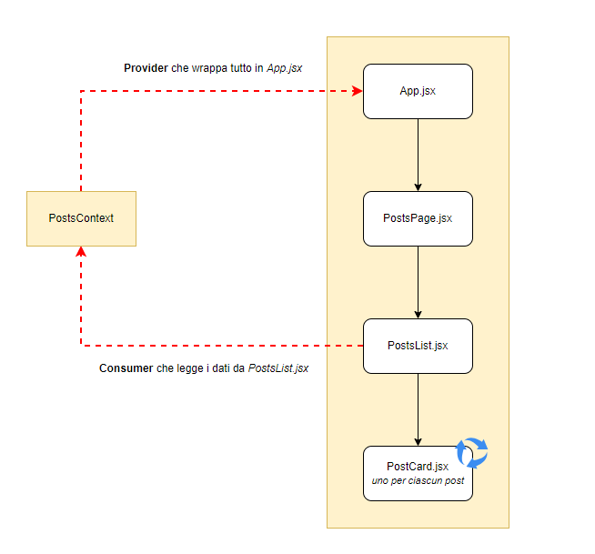

# React Context API

## Descrizione

Sfruttare le Context API per rendere disponibile la lista dei post in tutta l'app. <br>
- Partire definendo la lista dei post all’interno di ```App.jsx``` <br>
- Creare un componente ```PostsPage.jsx```  che conterrà al suo interno un titolo e un componente ```PostsList.jsx``` che mostra la lista di tutti i nostri post. 
- Creare un file per definire il Context ed esportarlo.
- Importiamo il Provider in ```App.jsx``` e wrappiamoci la nostra applicazione
- Facciamo in modo che il componente ```PostsList.jsx``` recuperi i post consumando il Context e crei dunque una card per ciascuno di essi.

**La struttura dell’App deve essere** <br>
```App.jsx``` > ```PostsPage.jsx``` > ```PostsList.jsx``` > ```PostCard.jsx```

---

## Bonus

Implementare un componente ```Alert``` gestito tramite Context

---



Schema a blocchi del Context